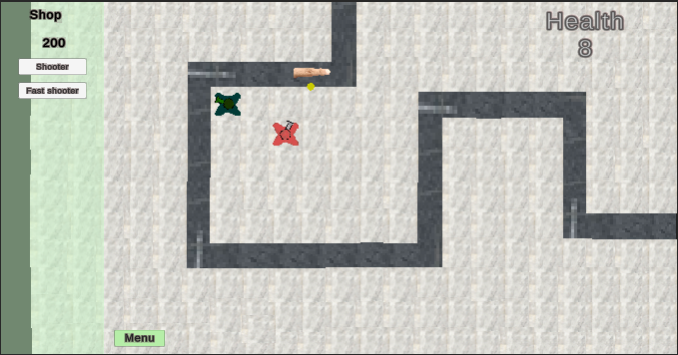
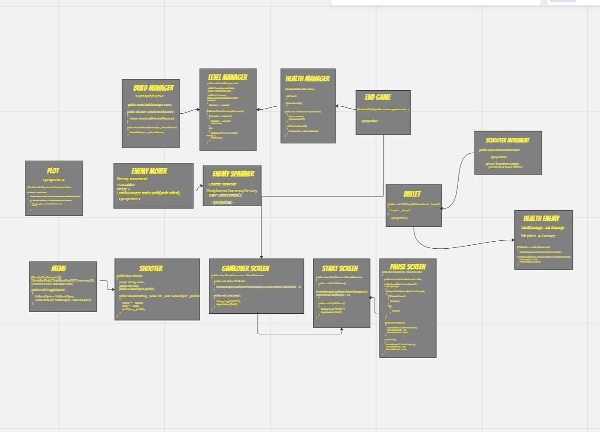

# TowerDefenseTemplate
dit is mijn tower Defense voor de BO van periode 5. In mijn Tower Defense moet je de flower Garden Beschermen tegen Slechte paarse Delete Virusen. je kan 2 verschillende towers kopen waardoor je ze beter kan beschermen. bij elke Virus die je dood krijg je 25 coins voor terug. als je helaas je 8 health verliest ben je gedelete door Del de virus. Er zijn 5 waves die je moet halen om te winnen

## Product 1: "DRY SRP Scripts op GitHub"

Dit script is DRY omdat je alleen er voor zorgt dat je als je op de plots hovered dat je er Shooters op kan zetten. en ik hoef me zelf er daardoor niet te repeaten
using System.Collections;
using System.Collections.Generic;
using UnityEngine;

public class Plot : MonoBehaviour
{
    [Header("References")]
    [SerializeField] private SpriteRenderer sr;
    [SerializeField] private Color HoverColor;

    private GameObject shooter;
    private Color startColor;

    private void Start()
    {
        startColor = sr.color;
    }
    private void OnMouseEnter()
    {
        sr.color = HoverColor;
    }

    private void OnMouseExit()
    {
        sr.color = startColor;
    }

    private void OnMouseDown()
    {
        if ( shooter != null) return;

        shooter shooterTobuild = BuildManager.main.GetSelectedShooter();

        if ( shooterTobuild.cost > LevelManager.main.Currency ) 
        {
            Debug.Log("you can't afford this tower");
            return;

        }

        LevelManager.main.SpendCurrency( shooterTobuild.cost );

        shooter shooterToBuild= BuildManager.main.GetSelectedShooter();
        shooter = Instantiate( shooterToBuild.prefab, transform.position,Quaternion.identity);
    }
}
dit script is SRP omdat het is gemaakt om 1 ding te doen en dat is de enemy te laten bewegen met de waypoints
using System.Collections;
using System.Collections.Generic;
using UnityEngine;

public class EnemyMovement : MonoBehaviour
{
    [Header("References")]                         //deze header zorgt er voor dat info overbrengt over een externe functieaanroep
        [SerializeField] private Rigidbody2D rb;

    [Header("Attributes")]
    [SerializeField] private float moveSpeed = 2f;

    private Transform target;
    private int pathIndex = 0;
    private void Start()
    {
        target = LevelManager.main.path[pathIndex];  //deze target zorgt ervoor dat de code die in 
    }                                                // De levelmaneger code staat ook hier wordt gebruikt deze code gebruikt het voor de Waypoint die  worden aangeroepen in de levelmanager 

    private void Update()         
    {
        if (Vector2.Distance(target.position, transform.position) <= 0.1f)    //Deze regel berekent de afstand tussen het huidige doelpunt (target.position) en de positie van het object (transform.position) met behulp van Vector2.Distance
        {
            pathIndex++;

            if (pathIndex == LevelManager.main.path.Length) 
            {
                EnemySpawner.onEnemyDestroy.Invoke();
                Destroy(gameObject);
                return;
            }
            else
            {
                target = LevelManager.main.path[pathIndex];

            }
        }
    }

    private void FixedUpdate()
    {
        Vector2 direction = (target.position - transform.position).normalized;

        rb.velocity = direction * moveSpeed;
    }
}

## Product 2: "Projectmappen op GitHub"

## Product 3: Build op Github

## Product 4: Game met Sprites(animations) en Textures 

## Product 5: Issues met debug screenshots op GitHub 

## Product 6: Game design met onderbouwing 

## Product 7: Class Diagram voor volledige codebase 

## Product 8: Prototype test video

## Product 9: SCRUM planning inschatting 

## Product 10: Gitflow conventions

